# Enterprise Mortgage Platform — High-Level Deployment Diagram

**Document ID:** PLAT-001-T04-C

The following Mermaid diagram is the source-controlled architecture diagram for PLAT-001-T04.

```mermaid
flowchart TB
    Client[External Client / Channel]
    IdP[OIDC / OAuth2 Identity Provider]
    Edge[Load Balancer / Ingress / WAF]
    Gateway[mortgage-api-gateway]

    Client -->|Authenticate| IdP
    Client -->|HTTPS + JWT| Edge
    Edge --> Gateway

    subgraph K8S[Kubernetes - Mortgage Platform]
        Gateway

        Customer[customer-service]
        Application[mortgage-application-service]
        Financial[borrower-financial-service]
        Property[property-service]
        Document[document-service]
        Product[mortgage-product-service]
        Credit[credit-service]
        Appraisal[appraisal-service]
        Risk[fraud-risk-service]
        Policy[policy-service]
        UW[underwriting-service]
        Manual[manual-review-service]
        Conditions[conditions-service]
        Pricing[pricing-service]
        Closing[closing-service]
        Booking[loan-booking-service]
        Funding[funding-service]
        Servicing[servicing-service]
        Payment[payment-service]
        Notify[notification-service]
        Audit[audit-service]

        Gateway --> Customer
        Gateway --> Application
        Gateway --> Financial
        Gateway --> Property
        Gateway --> Document
        Gateway --> Product
        Gateway --> Conditions
        Gateway --> Pricing
        Gateway --> Servicing
        Gateway --> Payment
    end

    Kafka[(Kafka)]
    Redis[(Redis)]
    Oracle[(Oracle Platform)]
    Obs[Prometheus / Grafana / OTel / Logs]

    Application --> Kafka
    Credit --> Kafka
    Appraisal --> Kafka
    Risk --> Kafka
    Policy --> Kafka
    UW --> Kafka
    Manual --> Kafka
    Conditions --> Kafka
    Closing --> Kafka
    Booking --> Kafka
    Funding --> Kafka
    Servicing --> Kafka
    Payment --> Kafka
    Kafka --> Audit
    Kafka --> Notify

    Customer --> Oracle
    Application --> Oracle
    Financial --> Oracle
    Property --> Oracle
    Document --> Oracle
    Product --> Oracle
    Credit --> Oracle
    Appraisal --> Oracle
    Risk --> Oracle
    Policy --> Oracle
    UW --> Oracle
    Manual --> Oracle
    Conditions --> Oracle
    Pricing --> Oracle
    Closing --> Oracle
    Booking --> Oracle
    Funding --> Oracle
    Servicing --> Oracle
    Payment --> Oracle
    Notify --> Oracle
    Audit --> Oracle

    Gateway -. approved cache use .-> Redis

    Gateway -. telemetry .-> Obs
    Customer -. telemetry .-> Obs
    Application -. telemetry .-> Obs
    UW -. telemetry .-> Obs
    Servicing -. telemetry .-> Obs
    Payment -. telemetry .-> Obs

    CreditProvider[Credit Bureau]
    AppraisalProvider[Appraisal Provider]
    RiskProvider[Fraud / Risk Provider]
    PaymentRail[Payment / Funding Provider]
    MsgProvider[Email / SMS Provider]
    ObjectStore[Document / Object Storage]

    Credit --> CreditProvider
    Appraisal --> AppraisalProvider
    Risk --> RiskProvider
    Funding --> PaymentRail
    Payment --> PaymentRail
    Notify --> MsgProvider
    Document --> ObjectStore
```

## Diagram Interpretation

The Oracle node represents the Oracle platform, not a shared logical database.

Each service connects only to its own schema as defined in PLAT-001-T02.

Kafka represents the event backbone defined in PLAT-001-T03.

The diagram intentionally omits exact Kubernetes Services, ports, resource sizing, topic partitions, node pools, and network policies. Those belong to later implementation tasks.
